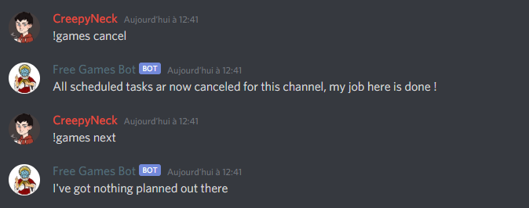
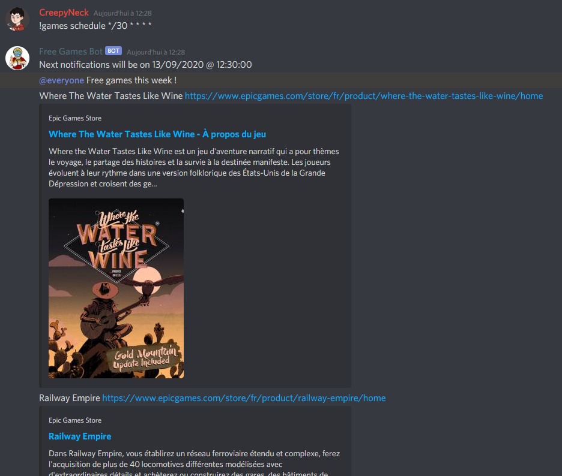

# Free-Games-Bot

Bot for discord that fetch free games with a schelued tasks using cron expression and posting into specified channels. This bots will 

## Installation
```bash
npm install
```
Depedencies :
- [heroku](https://heroku.com/) to deploy, and [dotenv](https://www.npmjs.com/package/dotenv) package in order to read .env file on startup, allowing debugging
- [discordJS](https://discord.js.org/?source=post_page---------------------------#/) to post messages and wait for commands
- [moment](https://momentjs.com/) to ease date formatting
- [node-schedule](https://www.npmjs.com/package/node-schedule) to schedule notifications using cron expressions
- [axios](https://www.npmjs.com/package/axios) to make webservices calls to each games stores.

## How to add this bot in discord
First, [follow this guide](https://discordjs.guide/).

In discord, copy the channel Id [(requires discord dev mode)](https://www.discordia.me/en/developer-mode) where you want the bot to work, and paste it into .env file, in CHANNELS_IDS value (comma separated). Now the bot will respond its command.

This bots needs those permissions in order to work properly :
 - Read messages
 - Send messages
 - Embed link
 - Read messages history
 - Mention everyone


## Usage
For each commands below, the channel id need to be into the CHANNELS_IDS list of the .env file in order for the bot to respond.

```
!games [options]
```
- Without any options, the bot will fetch free games on each programmed websites
- Options are :
  - ping : basic ping response
  - schedule : create a scheduled tasks which will run in the channel using GAMES_CRON value in .env file by default. If cron expression is provided, the will attempt to use it or fallback to default cron expression, see [cron expressions here](https://crontab.guru/every-day-at-1am).
  - cancel : cancel scheduled tasks for this channel
  - next : print when the next notofications will occur
  - help : print help about !games command with no arguments
  - usage : print info about all commands of the bot
  - sources : print the list of known sources
  - 

## Examples



## .env file

|Name|Description|Example value|
|---|---|---|
|PREFIX|Prefix for each command|`!`|
|COMMAND|Command name for this bot|`games`|
|TOKEN|Token of your boot, see [this](https://discordjs.guide/preparations/setting-up-a-bot-application.html#your-token)|`4815162342`|
|CHANNELS_IDS|List of channels ids where the bot is allowed to posts|`42,9001,4815162342`|
|CHANNELS_IDS_TO_SCHEDULE|List of channels ids where the bot will automatically schedule on startup. Those ids also needs to be on CHANNELS_IDS|`42,9001`|
|GAMES_CRON|Cron expression used to schedule periodical verification and post of free games. In this exemple, each Thursday at 9am|`0 9 * * THU`|

